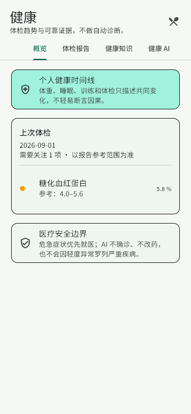
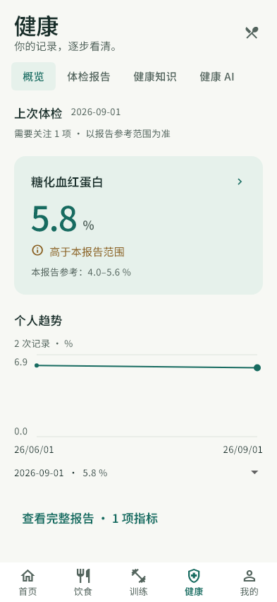

# UI / UX Redesign — Impeccable Pass

状态：Design System + Health Overview Reference 阶段已完成本地验证。选定 C Data-forward；全应用逐页推广尚未完成。本轮没有新增业务模块，没有 push / 发布，也没有宣称 iPhone 真机验收通过。

## 范围与基线

- 工作分支：`feature/ui-redesign-impeccable`。
- 初始提交：`5ec6340d0b06e4cdfdfce38c63a1bd33c8cc76fb`。
- 初始工作树仅有已有、未跟踪的 `ui-preview/`，原工程保留。
- 产品：iOS First 私人 Personal Health OS，仅供个人长期使用；Quiet Premium Health Intelligence。
- 方向：Data-forward Health Intelligence 为主，适量 Warm Personal Wellness。不采用医院、健身、减肥打卡、企业后台、广告或游戏化视觉。
- 修改限于 Flutter theme、tokens、presentation、底部导航及测试 / 文档。本轮没有修改 backend、模型 / 控制器 / API / 数据库、算法、认证、HealthKit、RAG / Provider、离线同步或通知实现。
- UI 对未确认草稿、已确认报告和报告 flags 的分组是证据呈现，不重新计算医学阈值。旧 attentionCount 仅含 high / low 的定义没有修改，critical 独立显示提醒。
- 不要求本地 Mac。浏览器可看外观，但不能取代实际 iPhone 验收。

## 官方工具安装与 Hook

- 官方来源：`pbakaus/impeccable`，没有使用第三方同名 fork。
- 安装：`npx --yes --proxy=http://127.0.0.1:7897 impeccable@4.1.0 install --providers=codex --scope=project`。
- 第一次读取验证包超时；使用已有本机代理重试成功，没有跳过完整性验证。
- CLI `4.1.0`、技能元数据 `4.5.0`、Windows 引擎 `0.1.11` 分别记录。
- 技能：`.agents/skills/impeccable/`；Hook 清单：`.codex/hooks.json`。
- 本轮 context 对健康页运行一次，初始报告 `NO_PRODUCT_MD / PRODUCT_INIT_REQUIRED`；用户确认定位后写入 `PRODUCT.md`。
- hooks status 显示 enabled、无忽略 / 环境禁用。配置 enabled 不等于原生信任批准，也不等于实际 Hook 已执行。

> Codex native hook approval entry unavailable in current environment.

按用户明确指示继续 UI 工作；没有绕过安全机制、改写信任记录、禁用 Hook 或反复要求批准。官方 Hook 扩展名不包含 Dart，不能把返回空列表当作 Flutter 原生审查通过。

## 审查与工作流

使用 Impeccable 的 critique → layout → typeset → colorize → distill → adapt → harden → polish → audit 方法，并优先遵守 iOS 系统字体、触摸目标和平台交互。没有把 Impeccable 当作 UI Framework，没有改成 React / Web App。

两个独立代理获得用户明确许可，只评审、未修改代码：

- A：视觉层级 / 排版 / 颜色 / 品牌 / iOS 审美。
- B：信息架构 / 可用性 / 无障碍 / 真实健康场景。

初次完整审查为 23/40，收敛为两个 P1：数据阅读层级弱、证据与状态的呈现不充分。正式归档：
`.impeccable/critique/2026-10-04T09-31-28Z__es-health-presentation-health-screen-dart-ff3b0e7e.md`。
单一方向 brief：
`.impeccable/surfaces/es-health-presentation-health-screen-dart-ff3b0e7e.md`。

B 对旧 Mock 做了真实 Web 检测：4 个视图出现 9 项、4 类命中，包括小字、标题层级和输入提示对比度；部分禁用态属于需要判断的误报。隔离浏览器 mutation / script preflight 成功，检测脚本确实运行；headless DOM overlay 不等于用户看到审查叠层。Dart detector 返回 [] 属于不支持，不是原生清洁证明。

最终 A 只读查看真实 Flutter Before / 三方案 / 深色及源码，视觉评价 8/10、无阶段阻断；该分数不是原 Nielsen 23/40 的重测，不能计算改善趋势。B 发现语义点击遗漏，已修复并用动作断言验证；未发现其他本轮严重 UI 回归。原生 audit 的证据为源码、widget tests 和实际 Flutter test-engine 截图，物理 iOS 部分仍待验收。

本轮选择代码原生可运行方案，不声称生成过 AI 效果图。用户已明确 Flutter 平台和 C 方向；没有永久修改 Skill 的默认构建路径。

## 三个同数据方向与选择

三套共享报告日期 2026-09-01、HbA1c 5.8%、报告范围 4.0–5.6%、high flag；历史为 2026-06-01 的 6.0% 与 2026-09-01 的 5.8%。不制造健康评分、周状态或诊断。共享语义颜色和稳定的五项导航，差异集中在排版、surface 和历史数据组织。

| 方案 | Typography / hierarchy | Color / surface | 历史呈现 |
| --- | --- | --- | --- |
| A Quiet Clinical Premium | 主数值更紧凑（32），直接开放排版 | 克制青绿数字，无主指标背景面 | 同一真实日期图表 |
| B Warm Personal Wellness | 大数值（48），更接近个人记录的阅读顺序 | 开放排版、温和状态文字 | 同数据的日期记录列表 |
| C Data-forward Health Intelligence | 大数值（48）、单位弱化、报告状态与范围紧随 | 一块低饱和主指标 surface；其余内容开放 | 日期 / 数值尺度与可读记录选择器 |

选择 C，符合用户已确认的主方向。没有混合成三套风格。A / B 仅为参考比较，不改变业务或默认生产方向。

## 实际 Flutter 改动

### Design System

- `AppColors`：语义化浅深色 palette；primary / accent / positive / attention / warning / danger / 三层 surface / 三层 text / divider。
- `AppTypography`：Page Title、Hero Metric、Section / Card Title、Body、Secondary、Caption、Metric Label、Metric；主数字 tabular figures。
- `AppSpacing`：固定 4 / 8 / 12 / 16 / 20 / 24 / 32 / 40 / 48 尺度。
- `AppRadius`：small / medium / large / hero，避免统一大圆角或全 pill。
- `AppElevation`、`AppMotion`、`AppIconSize`、`AppComponentSize`：扁平层级、短目的性过渡、Reduce Motion、统一尺寸和 44pt 最低目标。
- Material 主题显式映射主 / 次操作色、tonal surface 和文字；borderless cards / fields、轻量 focus、无强阴影。
- 保留运行时平台系统字体。测试用 Noto Sans SC 不在 App asset 声明内，不替换 iPhone 系统字体。
- 规范：`DESIGN.md`；扩展 sidecar：`.impeccable/design.json`。浏览器 component snippets 和合成色阶只是规范面板示意，不是 Flutter 组件或新增 App 色值。

### 健康参考页

- 删除抢占焦点的时间线介绍 banner / 大安全卡堆叠，建立报告上下文 → 主指标 → 个人趋势 → 完整报告 → AI 理解入口 → 折叠安全说明。
- 只有 confirmed 报告进入正式证据；草稿单独引导核对。
- MetricFocus / HealthMetricRow：名称、值、单位、报告范围、文字状态；颜色不作为唯一信号。危急提醒来自既有 report flag。
- 趋势使用真实日期位置、有限数值、相同单位、稀疏网格与真实纵轴；正值从 0 起，避免极窄 min-max 放大轻微波动。
- 提供点选择器读取日期 / 值；单条与不可比较单位明确说明；不伪造范围线或趋势结论。
- Skeleton / empty / error 有可读状态及原有上传 / 重试行动；不泄漏原始异常。
- 指标详情允许滚动；图表随 text scaling 自然增高；长中文允许换行。
- 程序化 tab 切换遵守 Reduce Motion。底部目标实际变化才 selection haptic。
- 仍使用统一 outlined Material icon family，不宣称已换为 SF Symbols。
- 旧 OCR 编辑 / AI 等其余 tab 的完整 UI 重设计与交互 hardening 尚未开展；未悄悄修改其业务流程。

### 导航与其他页

五项底部导航改为 solid surface、文字 + 统一图标、克制选中颜色，无大椭圆 / 巨大 icon tile。IndexedStack 和原目的地保持不变。

Dashboard / Nutrition / Training 已做共享主题兼容与 Golden 回归，仍保留原页面内容结构，不称为整页重设计完成。AI / 我的 / 其余健康流程属于后续 rollout。

## Before / After 证据

| 证据 | 文件 |
| --- | --- |
| 真实 Flutter Before 浅 / 深 | `docs/ui-redesign/before/health-overview-light.png` / `health-overview-dark.png` |
| C After 浅 / 深 | `mobile/test/goldens/health-overview-light.png` / `health-overview-dark.png` |
| A / B | `mobile/test/goldens/health-variant-clinical.png` / `health-variant-warm.png` |
| 其他页主题回归 | `mobile/test/goldens/dashboard-light.png` / `nutrition-light.png` / `training-light.png` |
| 旧 Mock 的七状态 Before | `artifacts/ui-redesign/before/`（本地、ignored） |
| 手机浏览器对照入口截图 | `artifacts/ui-redesign/preview/iphone-evidence-preview.png`（本地、ignored） |

这些是真实 Windows Flutter widget-test 引擎渲染，393×852 测试视口、已加载中文与 icon 测试字体，不是 iOS Simulator 或物理 iPhone截图。Before 不含本轮新增统一底部导航，After 包含；不能把外壳差异当作单一变量实验。中文字体固定 Google Fonts commit 并保留 OFL，来源与 SHA 见 `mobile/test/assets/README.md`。

主代理直接查看全部七个 After。参考页第一轮发现绘图区宽度塌缩，只剩点；修复后第二轮截图确认真实趋势线。其他三页随后仅按统一 tonal tokens 刷新主题兼容图，没有反复混合或推翻参考方向。

## 真实测试结果与修复记录

本地 Flutter 3.47.5。Windows 非 ASCII 工作区测试临时使用 `X:` 到本工作区的映射和项目已有缓存；没有改业务配置 / test 条件或 CI 检查。

| 检查 | 最终真实结果 |
| --- | --- |
| `flutter analyze --no-pub` | No issues found |
| `flutter test --no-pub --reporter expanded` | 63 passed（47 原有 + 7 Golden + 9 无障碍 / 状态） |
| Golden 最终比对 | 不带 `--update-goldens`，全部成功 |
| 浅 / 深普通正文、状态及 primary / tonal / error 操作文字 | 测试组合 >=4.5:1 |
| 320pt、200% 字号浅 / 深中文 | 无 layout exception；可滚动、实际点击指标并访问详情行动 |
| 合并语义、44pt、iOSTapTargetGuideline | 成功，包含 SemanticsAction.tap |
| 草稿 / empty / error / loading | 成功，草稿不替代 confirmed，异常不泄漏 |
| 日期选择、单位过滤、Reduce Motion | 成功 |
| Preview `npm run build` | TypeScript + Vite 成功；仅本地构建，没有发布 |
| Runtime integrity | 28 个受保护文件全部通过，未改 runtime / lock |
| 隔离 Edge `verify-redesign-evidence.mjs` | 5 状态、图像字节一致、实际屏幕 44px、旧 Mock 导航保留、无 page errors / external requests |
| LAN HTTP 入口 | 本机访问 192.168.1.18:4173 返回 200；未声称手机已亲测 |
| 本轮真实 GitHub CI / iOS 构建 | 未触发，不能沿用旧 run 声称本轮通过 |
| iPhone Dynamic Type / VoiceOver / Safe Area / haptics / 性能 | 尚未真机验收 |

实际失败及修复：

1. 新旧 OCR 复用的 _FlagDot 在拆分时遗漏，编译失败；恢复为文字 + 语义 icon，旧健康回归通过。
2. 浅色 tertiary text 在 soft tint 对比度为 4.2979，保留 >=4.5 断言并调深 primitive；浅深均通过。
3. 320pt / 200% 图表纵轴 Column 下方溢出 16px；移除固定整图高度，绘图区与其余文字分别自然布局。
4. 大字号测试在 scroll 后未等待布局、点击巨大卡片旧中心导致 miss；等待 pump 后点击实际可见标题，并断言详情 CTA hit-testable，没有隐藏 warning 或降低要求。
5. SemanticsHandle 清理时机错误；改 try / finally 在测试 body 内释放，保留 guideline。
6. B 发现外层 excludeSemantics 丢失 tap action；补外层 onTap 和 SemanticsAction.tap 断言。
7. 预览保护 runtime 会缩放整台设备，小屏 reviewer 控件实际不足 44px；仅放大 app-owned 评审控件，未改 native tokens 或 runtime。
8. 预览验证 APIRequestContext 的相对 URL 无 base；改显式本地 URL。不是业务网络问题。

没有删除 / skip / disable 测试，没有降低 lint、字号检查或 contrast 阈值。

## 预览与下一阶段

### 阶段提交与环境恢复

- `af8916d`：官方安装 / 初始化。
- `4459ee4`：Flutter design tokens / theme。
- `a7653c4`：实际健康参考页与可访问趋势。
- `e9bc527`：共享底部导航。
- `af42dd2`：7 Golden + 9 无障碍 / 状态测试及测试字体。

规范、baseline 证据与本报告随后以 `docs(ui)` 提交。未 push。测试结束后已通过 Unicode 原生路径解析核实 X: 正是本工作区，只移除该临时映射，没有删除文件；`flutter pub get --offline` 已将本地依赖路径恢复到真实 E: 工作区，没有升级依赖。

本地 / 同一 Wi-Fi iPhone：
`http://192.168.1.18:4173/?redesign=1`。
电脑：
`http://localhost:4173/?redesign=1`。
全屏查看当前 C：
`http://192.168.1.18:4173/assets/ui-redesign/health-overview-light.png`。

入口保留原 PhoneFrame / StatusBar / HomeIndicator / Keyboard / MobileScroll，提供 C / A / B / 深色 / Before 对照；明确标注真实 Flutter 截图是静态证据，图内按钮不可操作。旧交互 Mock 仍在 `/`，尚未整体更新，不把它当作本轮新原生 UI。截图使用虚构数据，无真实 API / 模型 / 报告 / 餐食或权限请求。没有公开部署、没有仓库 push。

已有未跟踪的 `ui-preview/` 保留为本地预览工程，不把整个原有未跟踪项目混入本轮 Flutter 提交；原生实现、tests、规范与证据分阶段提交。工作树不能因此被表述为“全部干净”。

下一步按同一 C 语言逐页推进：Dashboard → Nutrition → Training → 健康剩余流程 / Personal Coach → 我的。已知旧 OCR / AI 请求状态问题单独做 presentation hardening；缓存序列化等业务问题不在本轮擅改。

实际 iPhone 验收不以“拥有本地 Mac”为门禁：后续沿项目允许的云构建 / 个人安装路线检查系统字体、真实 Safe Area、VoiceOver、Dynamic Type、手势、haptic、权限和滚动性能。真实 CI 与设备检查未执行前，保持明确的待验收状态。
